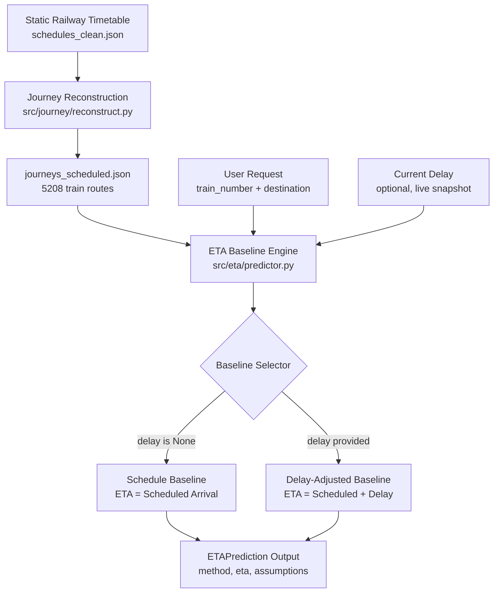
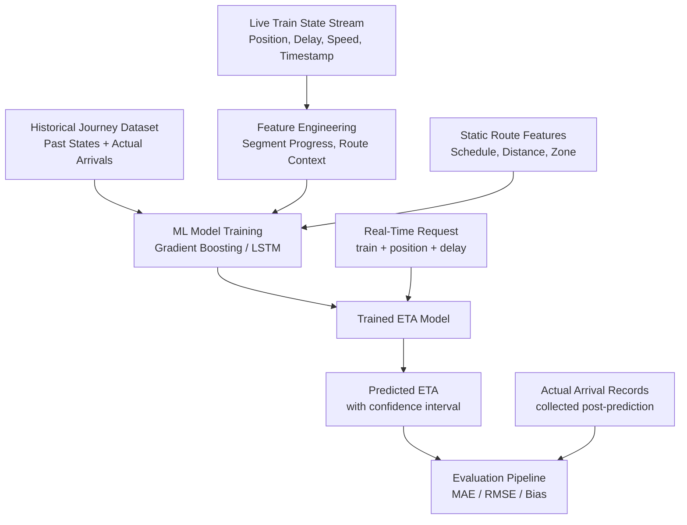

# ETA System Architecture

This document describes the current and planned future architecture of the SIH Indian Train ETA system.

---

## Current System Architecture

**Constraints of the Current System:**
- All ETA estimates are based on static timetable data
- No live position tracking
- No ML model; fully deterministic
- Cannot be evaluated for accuracy (no actual arrival ground truth)

---

## Future System Architecture (when historical data is available)

**Requirements for Future System:**
- Continuous ingestion of live train state (position, delay, speed, timestamp)
- Storage of historical individual journey records with verified actual arrivals
- Minimum dataset size: ~30 journeys × 500+ trains across multiple seasons
- Rigorous train/test split to prevent data leakage

---

## Transition Plan

| Phase | Description | Status |
|---|---|---|
| Phase 0 | Data ingestion, cleaning, validation | ✓ Complete |
| Phase 1 | Journey reconstruction + EDA | ✓ Complete |
| Phase 2 | Schedule-based ETA baselines | ✓ Complete (Chunk 3) |
| Phase 3 | Live data collection pipeline (sustained) | ⏳ Not started |
| Phase 4 | Historical dataset assembly + feature engineering | ⏳ Blocked on Phase 3 |
| Phase 5 | ML model training + evaluation | ⏳ Blocked on Phase 4 |
