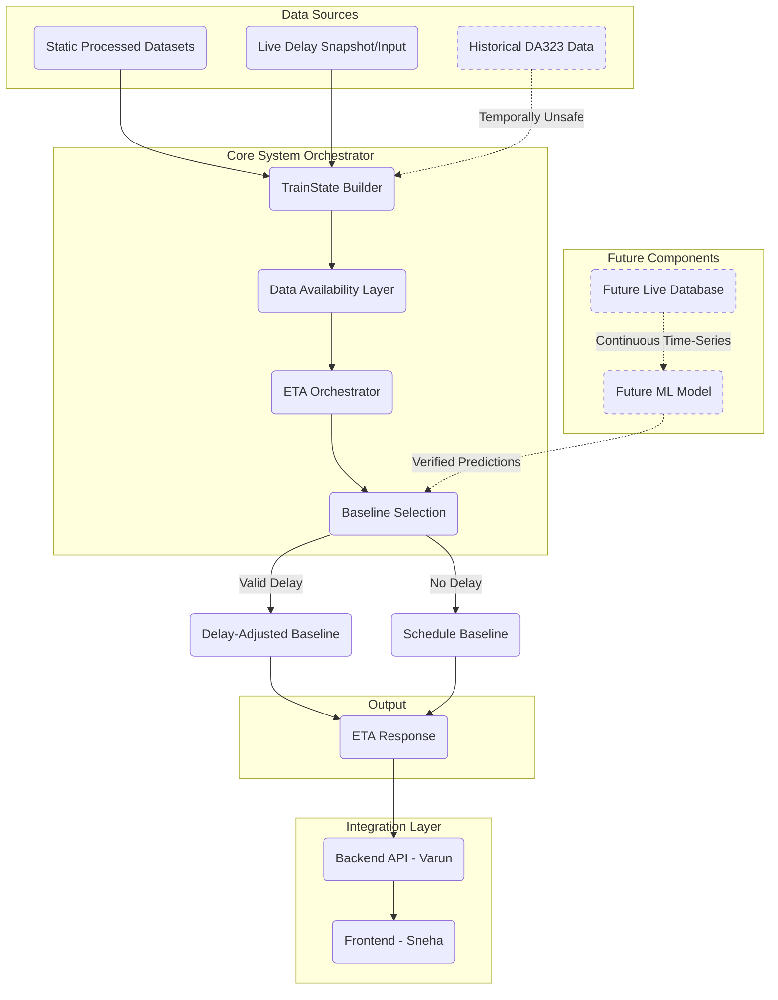

# Final System Data Flow

This document visualizes the data flow for the Group A ETA prediction system.

## Key Points:
1. **Historical DA323 Data** is parsed and available in the `TrainState` but is explicitly bypassed by the ETA Orchestrator during baseline calculation to prevent data leakage.
2. The **Baseline Selection** is strictly deterministic, choosing between schedule-only or current-delay-adjusted.
3. The system explicitly plans for **Future Components** (ML modeling and Live DB) which are currently missing.
