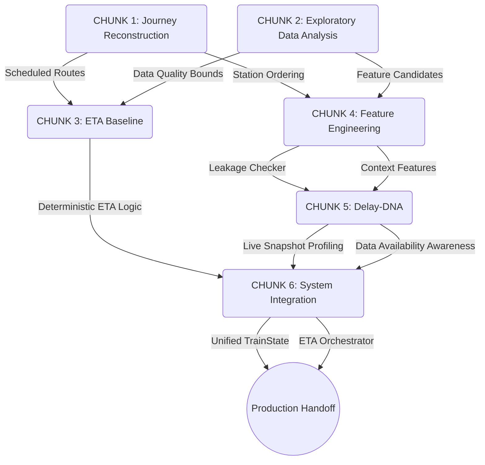

# Group A Architecture Map

This document maps how the sequential chunks of Group A's work built upon each other to create the final unified ETA system.

## Component Roles

### CHUNK 1: Journey Reconstruction
**Role:** Established the foundational `journeys_scheduled.json`. Translated messy timetable datasets into strictly ordered, day-offset routed journeys for each train.
*Constraint:* This is purely scheduled logic, not actual train movement.

### CHUNK 2: Exploratory Data Analysis
**Role:** Profiled the datasets to identify missing values, impossible delays, and coverage gaps. Concluded that historical individual train sequences were missing.
*Constraint:* Defined the boundaries of what could be modeled (no ML).

### CHUNK 3: ETA Baseline
**Role:** Built the core deterministic prediction logic (`SCHEDULE_BASELINE` and `DELAY_ADJUSTED_BASELINE`) and time-math utilities.
*Constraint:* ETA is deterministic calculation, not statistical inference.

### CHUNK 4: Feature Engineering
**Role:** Created a modular pipeline to extract static, route, and historical features, protected by a strict `LeakageChecker` to identify temporally unsafe data.
*Constraint:* Blocked the DA323 dataset from being used as a live predictive feature.

### CHUNK 5: Delay-DNA
**Role:** Built an analytical framework to categorize and understand current delay snapshots and station contexts without implying causation.
*Constraint:* Recovery computation framework built, but execution blocked due to missing time-series data.

### CHUNK 6: System Integration
**Role:** The final integration layer. Wrapped the baselines, feature extractors, and Delay-DNA context into a unified `TrainStateBuilder` and `ETAOrchestrator`, providing clean JSON contracts for backend integration.
*Constraint:* Output responses explicitly document all assumptions, limitations, and data completeness metrics.
